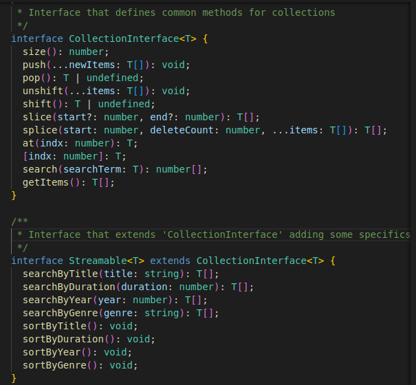

# Tareas previas
* Aceptar la invitación a la tarea en Github Classroom
* Instalación y configuración de las herramientas Instanbul y Coveralls para el cubrimiento de código.

# Ejercicios

## Ejercicio 1 - DSIflix

El enunciado describe la tarea de diseñar el modelo de datos para una plataforma de vídeo en streaming que ofrece películas, series y documentales. Se pide que se defina una interfaz genérica Streamable que especifique propiedades y métodos para una colección de streams concretas y una clase abstracta genérica BasicStreamableCollection que implemente la interfaz genérica. Esta última clase abstracta genérica deberá extenderse obteniendo subclases que modelen cada tipo de colección. 

## Implementación

He deicido modelar este ejercicio creando las siguientes clases:

* *Film, Serie, Documentary*: He creado una clase para modelar cada tipo de objeto de este ejercicio. Estas clases extienden de una clase base genérica y abstracta: StreamableCategory.

* *StreamableCategory*: Implementa los atributos name, duration, year, genre propios de cualquier categoría de stream. Se apoya de la interfaz genérica StreamableCategoryInterface. Además introduce los métodos valueOf() y equal() para permitir la comparación de objetos de un mismo tipo, y métodos abstractos print() y toString() para la salida a consola.

* *BasicStreamableCollection*: Constituye la clase abstracta genérica básica para las colecciones de películas, series y documentales. Se apoya de dos interfaces también genéricas: Streamable y CollectionInterface. Dividí la funcionalidad en estas dos interfaces porque resulta en una mejor representación del modelado cumpliendo el cuarto principio SOLID Interface segregation.

CollectionInterface recoge los métodos básicos propios de cualquier colleción mientras que Streamable implementa métodos específicos para este ejercicio permitiendo la búsqueda y el ordenamiento de colecciones de stream.

* *FilmsCollection, SeriesCollection, DocumentaryCollections*: Por último estas son las colecciones de las categorías de stream que se solicitan en el ejercicio. Cada una de ellas especifica los métodos abstractos que se definen en la clase base y que permiten la búsqueda y ordeción por atributos de estas colecciones.

Se realizaron un total de 14 pruebas, superadas con éxito, para comprobar el correcto funcionamiento de la implementación de este ejercicio.

# Ejercicio 2 - Implementación de una lista y sus operaciones

# Referencias
* [Enunciado P06](https://ull-esit-inf-dsi-2223.github.io/prct06-generics-solid/)
